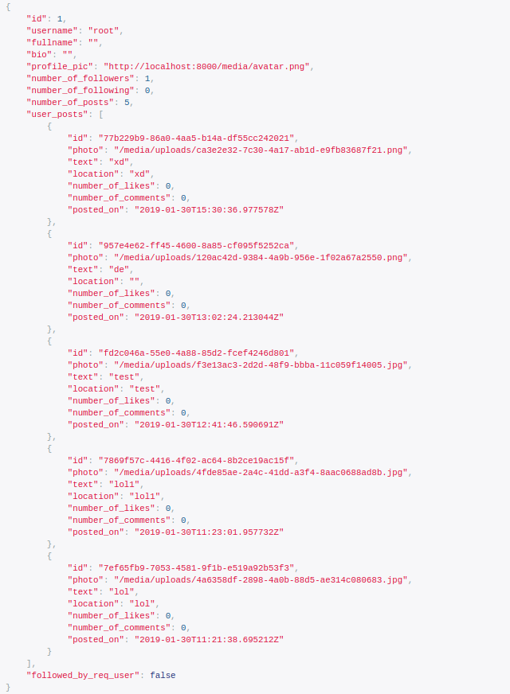
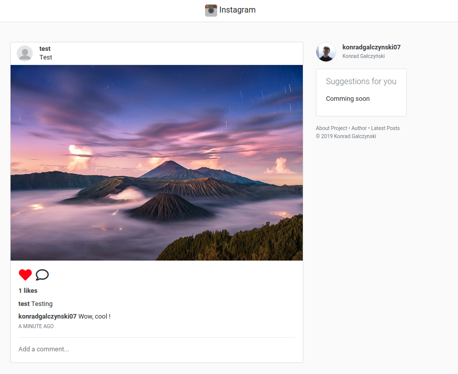

# instagram-rest-api

REST API with all basic features real Instagram has.

Take a look at the [frontend](https://github.com/konradgalczynski07/react-instagram) for this project as well.

## Features:

-   registering and logging to user account
-   posting photos
-   commenting and liking photos
-   following system
-   all CRUD operations on posts, comments, follows and likes with relevant permissions

## Technology Stack:

-   Python
-   Django and Django Rest Framework
-   PostgreSQL
-   Docker
-   TravisCI

## Default urls:

- localhost:8000/api/user/register/
- localhost:8000/api/user/login/
- localhost:8000/api/user/me/
- localhost:8000/api/user/<slug_username>/
- localhost:8000/api/user/<slug_username>/follow/
- localhost:8000/api/user/<slug_username>/get-followers/
- localhost:8000/api/user/<slug_username>/get-following/
- localhost:8000/api/post/
- localhost:8000/api/post/feed/
- localhost:8000/api/post/<post_id>/
- localhost:8000/api/post/comment/<post_id>/
- localhost:8000/api/post/comment/<comment_id>/
- localhost:8000/api/post/like/<post_id>/
- localhost:8000/api/post/<post_id>/get_likers/
  
## Instalation
1. Clone Git repository
2. Run `docker-compose up`

Sample response

Frontend feed page

